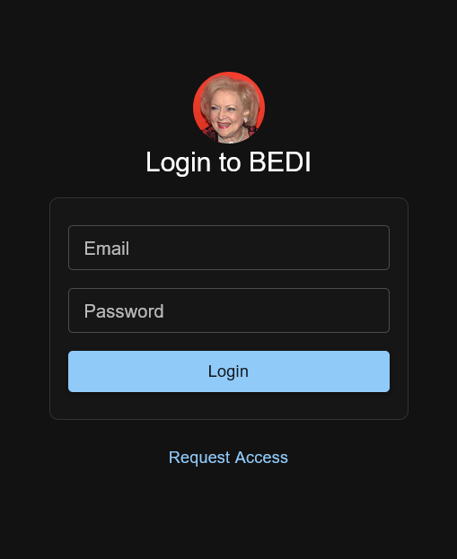
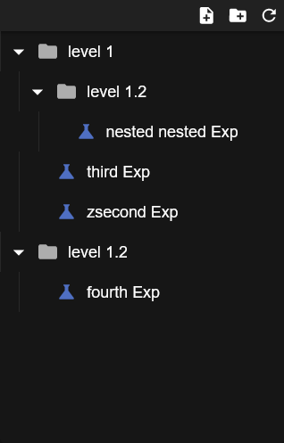

# bedi


better experiment data interface

This is a [Next.js](https://nextjs.org/) project bootstrapped with [`create-next-app`](https://github.com/vercel/next.js/tree/canary/packages/create-next-app).

### Progress

| Progress        |                                          |
| --------------- | ---------------------------------------- |
| Login Page      |         |
| File Tree       |  |
| Experiment View | wip                                      |
| Folder View     | wip                                      |
| Admin Page      | wip                                      |

## Motivation

The goal is to create a type-safe, maintainable, and easily deployable application to manage experiments data.

This is based on a previous experiment management web app. Much of the overall functionality remains the same, especially the database models which need to retain backward compatibility.

The key changes are a friendlier front-end framework (Angular -> React), modernized syntax (ES5 -> modern Typescript), testing (nothing -> something), and an integrated front-end and back-end (Express -> Nextjs API Routes).

I opted to combine implement the backend using Next.js's API routes, because it seems simpler to maintain. Time will tell. It is still very similar to Express so a change in the future shouldn't be too difficult.

## Getting Started

First, run the development server:

```bash
yarn dev
```

## NextJs API Routes

The `pages/api` directory is mapped to `/api/*`. Files in this directory are treated as [API routes](https://nextjs.org/docs/api-routes/introduction) instead of React pages.

### Testing

https://www.paigeniedringhaus.com/blog/how-to-unit-test-next-js-api-routes-with-typescript

I'm using MongoMemoryServer, and creating a new one in each test file to avoid race conditions.

## Mongoose

### Types

For each model, there is a mongoose schema, a "rich" mongoose document type, and a "dumb" JSONified and parsed document type. The mongoose types are used serverside, while the JSON type represents what the client receives from the server.

Right now, I'm defining the mongoose type twice, as an interface and mongoose schema. Two sources of truth isn't great, but this is the "official" method from the mongoose docs.

There are some libaries that may address this, but nothing stands out as the de-facto way.

https://github.com/francescov1/mongoose-tsgen

### Schemas

All model fields are either required or have a sensible default. No field should be in an undefined state ever, which reduces potential errors and simplifies types because we can trust that all fields exist.

Some fields are technically immutable, like `createdAt` or `dateCreated`, but I opted not to force it since there is no point. Nothing is going to update those fields, and there is no real danger/attack vector.

Generally, I opted to avoid settings which will never come into effect. For example, setting `trim: true` on name fields which come from user input, but not anything computed like `prefixPath`.

### Random tips and tricks

`Model.find()` is not a real promise, but is then-able and await-able
`Model.find().exec()` is a real promise

https://mongoosejs.com/docs/queries.html#queries-are-not-promises
https://stackoverflow.com/questions/31549857/mongoose-what-does-the-exec-function-do

`Model.find().lean()` gives an normal object instead of mongoose object

For some reason this just needs to happen

`sudo chown mongodb:mongodb /var/run/mongod.pid`

To connect to default uri

`mongosh --user USERNAMEHERE --authenticationDatabase bedi`

Patching `react-calendar-heatmap`

I patched in the following fixes

- https://github.com/kevinsqi/react-calendar-heatmap/issues/146

- https://github.com/kevinsqi/react-calendar-heatmap/pull/128
